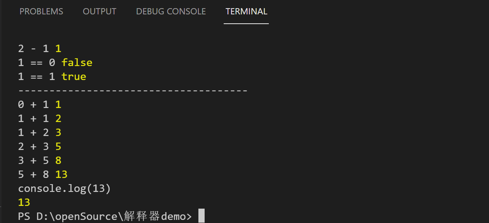

# 极简解释器

https://astexplorer.net/#/gist/6f7effa2b14399978fa2cb7337eae16e/263d1a1667a524cfdd3074c449d73a10226cc44b
```javascript
function test(i) {
  if(i==0){
  	return 0
  }
  if(i==1) {
    return 1
  }
  return test(i - 2) + test(i - 1)
}

let res = test(7)

console.log(res)
```

## 运行上面这段代码,运行结果如图



https://astexplorer.net/#/gist/30580b017c7b78240b3c4077c802d852/c847dce1340b513bb5964dd41ed622c6649932c2
```JavaScript
function test(i, cache) {
  if (cache[i] !== undefined) {
     return cache[i]
  }
  if (i === 0) {
    return 0
  }
  if (i === 1) {
    return 1
  }
  if (i === 2) {
    return 1
  }
  if (cache[i] === undefined) {
    let result = test(i - 1, cache) + test(i - 2, cache)
    cache[i] = result
    return cache[i]
  }
}

let res = test(7, {})

console.log(res)
```

